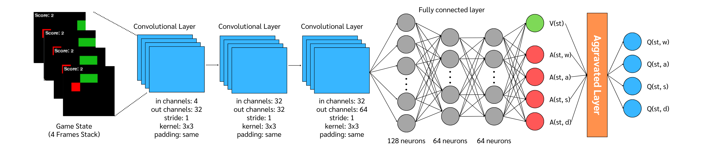
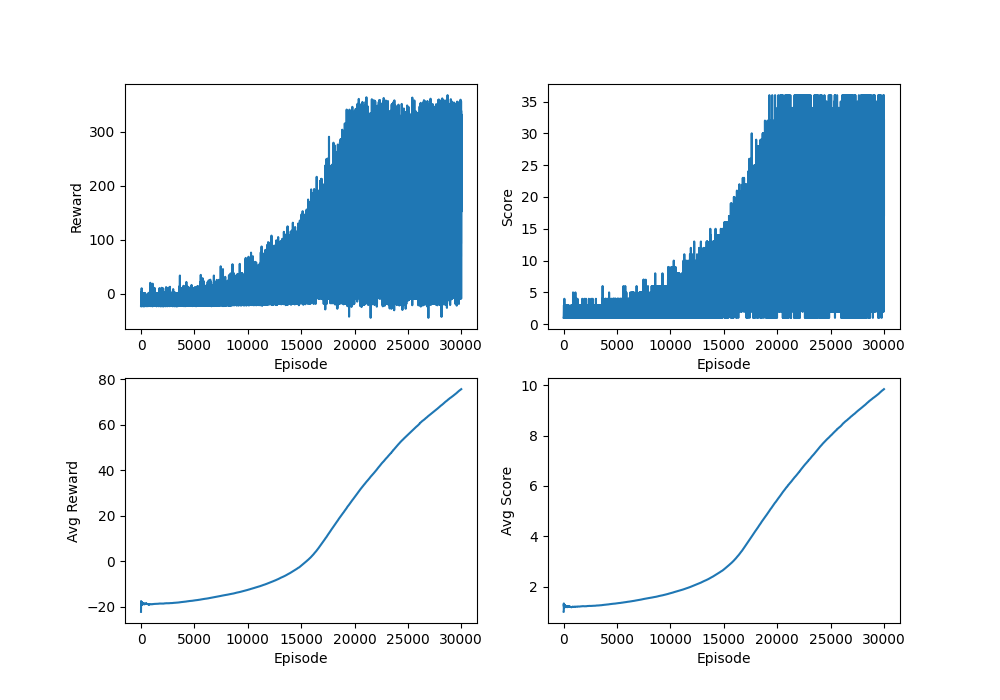

# Snake-RL
Deep-Q-Learning with various optimization technique implemented using pytorch to try and solve a 10x10 game of snake. The optimizations I use are Double Deep-Q-Learning, Dueling Structure and Noisy Network. In the future, I might also implement more optimizations or different reinforcement learning algorithms.<br><br>
For this project, I use Python 3.13.1, the game is written using Pygame, the reinforcement learning algorithm and anything related to it is implemented using pytorch, the plot is plotted using matplotlib and some calculations were done with the help of numpy.
## Usage
To clone this repository, run:
```
git clone https://github.com/mxilia/Snake-RL.git
```

then:
```
cd Snake-RL
```

Download the required library by running:
```
pip install -r requirements.txt
```

To train a new model, run:
```
python main.py -option 1 -modelName <Name>
```

To add optimization, use the following arguments:
<table>
    <tr>
        <th>Argument</th>
        <th>Info</th>
        <th>Default</th>
        <th>Action</th>
    </tr>
    <tr>
        <td>-dueling</td>
        <td>Passing this argument will make your model ultilise Dueling Structure.</td>
        <td>False</td>
        <td>Store true</td>
    </tr>
    <tr>
        <td>-double</td>
        <td>Passing this argument will make your model a Double DQN.</td>
        <td>False</td>
        <td>Store true</td>
    </tr>
    <tr>
        <td>-noisy</td>
        <td>Passing this argument makes your model ultilise Noisy Network for randomness instead of epsilon-greedy.</td>
        <td>False</td>
        <td>Store true</td>
    </tr>
</table>

For example, if you want to make a Double Dueling DQN, you run:
```
python main.py -option 1 -modelName <Name> -dueling -double
```

To adjust the hyperparameters, use the following arguments:
<table>
    <tr>
        <th>Argument</th>
        <th>Info</th>
        <th>Default</th>
    </tr>
    <tr>
        <td>-updateType</td>
        <td>
            Indicate whether the model is using interval target update or soft update<br>
            0: Interval target update, 1: Soft update<br>
            Example: -updateType 0
        </td>
        <td>1</td>
    </tr>
    <tr>
        <td>-episode</td>
        <td>
            Has 2 purposes. If you're training the model (-option 1) then this is the amount of the episodes the model'll be training for.<br>
            If you're testing the model (-option 2) then this is the version model you're going to test.<br>
            Example: -episode 50000
        </td>
        <td>10000</td>
    </tr>
    <tr>
        <td>-epsilon</td>
        <td>
            the starting value of epsilon.<br>
            Example: -epsilon 0.90
        </td>
        <td>1.0</td>
    </tr>
    <tr>
        <td>-epsDecay</td>
        <td>
            the rate of which epsilon is decaying.<br>
            Example: -epsDecay 0.99
        </td>
        <td>0.99999</td>
    </tr>
    <tr>
        <td>-epsMin</td>
        <td>
            the minimum value that epsilon can be.<br>
            Example: -epsMin 0.01
        </td>
        <td>0.02</td>
    </tr>
    <tr>
        <td>-discount</td>
        <td>
            the value of discount factor. the closer it is to 1, the more the model cares about the future reward.<br>
            Example: -discount 0.90
        </td>
        <td>0.99</td>
    </tr>
    <tr>
        <td>-lr</td>
        <td>
            the value of learning rate.<br>
            Example: -lr 0.01
        </td>
        <td>0.0001</td>
    </tr>
    <tr>
        <td>-batchSize</td>
        <td>
            the size of minibatch the model is sampling.<br>
            Example: -batchSize 64
        </td>
        <td>32</td>
    </tr>
    <tr>
        <td>-memSize</td>
        <td>
            the size of the replay buffer.<br>
            Example: -memSize 100000
        </td>
        <td>200000</td>
    </tr>
    <tr>
        <td>-targetInt</td>
        <td>
            the number of episode in between before copying online network params into target network params. (For -updateType 0)<br>
            Example: -targetInt 1000
        </td>
        <td>500</td>
    </tr>
    <tr>
        <td>-tau</td>
        <td>
            the rate of soft updating. (For -updateType 1)<br>
            Example: -tau 0.01
        </td>
        <td>0.005</td>
    </tr>
</table>

For example:
```
python main.py -option 1 -modelName <Name> -dueling -epsMin 0.01 -tau 0.0001 -discount 0.90
```

To adjust the environment, use the following arguments:
<table>
    <tr>
        <th>Argument</th>
        <th>Info</th>
        <th>Default</th>
    </tr>
    <tr>
        <td>-envCol</td>
        <td>
            the number of columns of the snake game grid.<br>
            Example: -envcol 6
        </td>
        <td>10</td>
    </tr>
    <tr>
        <td>-envRow</td>
        <td>
            the number of rows of the snake game grid.<br>
            Example: -envRow 6
        </td>
        <td>10</td>
    </tr>
    <tr>
        <td>-envPxSize</td>
        <td>
            the size of each grid in the snake game.<br>
            Note: this is only for display and changing anything here might glitch the game.<br>
            Example: -envPxSize 40
        </td>
        <td>20</td>
    </tr>
</table>

To change the environment, you just add these arguments into your command line:
```
python main.py -option 1 -modelName <Name> -dueling -envCol 5 -envRow 10
```

Here're the other useful arguments:
<table>
    <tr>
        <th>Argument</th>
        <th>Info</th>
        <th>Default</th>
    </tr>
    <tr>
        <td>-checkpoint</td>
        <td>
            the number of episodes in between before saving the model.<br>
            Example: -checkpoint 5000
        </td>
        <td>2000</td>
    </tr>
    <tr>
        <td>-option</td>
        <td>
            -option 0 (If you want to play the game yourself.)<br>
            -option 1 (If you want to train the model.)<br>
            -option 2 (If you want to test the model.)<br>
            -option 3 (if you want to plot the model's result.)<br>
            -option 4 (if you want to evaluate the model.)
        </td>
        <td>None</td>
    </tr>
</table>

After training, to test the model, run:
```
python main.py -option 2 -modelName <Name> (SpecifyOptimizations) -episode <Version>
```

For example, if you trained a Dueling DQN named "bob", you want to test it when it's at episode 12000 and the environment is 7x7, run:
```
python main.py -option 2 -modelName bob -dueling -episode 12000 -envCol 7 -envRow 7
```

To plot the model's result, run:
```
python main.py -option 3 -modelName <Name>
```

To evaluate the model's result, run:
```
python main.py -option 4 -modelName <Name> (SpecifyOptimizations) -episode <Version>
```
Note: The argument is the same as -option 2.

To play the game yourself, run:
```
python main.py -option 0
```

## Performance
### Solving 6x6
Before solving 10x10, I tried solving 6x6. The model I used is Convolutional Dueling Double Deep-Q-Learning. I didn't use noisy network because it keeps looping therefore takes a lot of time to learn. The model structure:<br><br>

<br><br>
The convolutional layer takes 4 continuous frames of the game state in and then process it and send it to fully connected layer as shown in the picture then it outputs Q-Value for each action.<br>
The hyperparameters are as following:
- epsilon: 1.0
- epsilon_decay: 0.99999
- epsilon_min: 0.01
- discount: 0.90
- learning_rate: 0.0001
- batch_size: 32
- memory_size: 200000
- tau: 0.005 (Soft update)

After training for 30000 episodes, here're the reward and score plots.<br><br>

<br><br>
Looking at the average reward plot, the curve's not stabilizing yet so there's definitely more room for the model to improve. Then I tested it for 500 games and this is the result:
- Average Score: 23.722
- Max Score: 36
- Min Score: 2

The max score is 36 meaning some of test runs have completed the game and mean score is around 23 which means the agent is performing above average which is not bad. I think If I had trained it for 20000 more episodes, it might reach the optimal minimum.<br><br>
The arguments for this model:
```
python main.py -option 1 -double -dueling -modelName dueling_ddqn_6x6 -envCol 6 -envRow 6 -episode 30000 -epsMin 0.01 -discount 0.90
python main.py -option 2 -double -dueling -modelName dueling_ddqn_6x6 -envCol 6 -envRow 6 -episode 30000
python main.py -option 3 -modelName dueling_ddqn_6x6
python main.py -option 4 -double -dueling -modelName dueling_ddqn_6x6 -envCol 6 -envRow 6 -episode 30000
```

### Solving 10x10
From the previous experiment, I decided to keep the same model and the same hyperparameters but this time I'm training the model for 50000 episodes and here're the plots:
## Reference
- [inspiration](https://github.com/benjamin-dupuis/DQN-snake/tree/master)
- [pytorch implementation](https://github.com/KimNattanan/dqn_pong)
- [dueling network](https://thammasorn.github.io/2020/07/18/Duel-DQN.html)
- [noisy network](https://arxiv.org/pdf/1706.10295)
- [double dqn](https://arxiv.org/pdf/1509.06461)